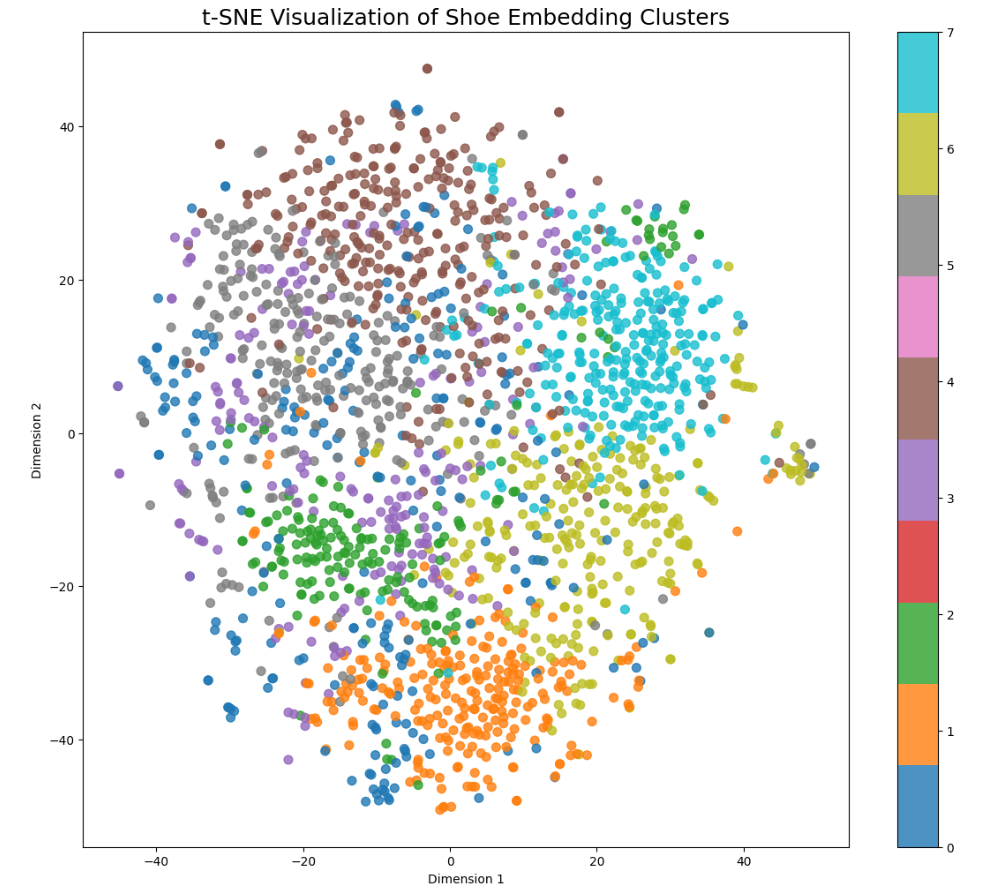

# TrustNet AI

TrustNet AI is a multimodal AI-powered trust and authenticity analysis platform focused on detecting:

- Fake product reviews
- Counterfeit product metadata
- Counterfeit product images

The project combines Deep Learning, NLP, Computer Vision, Retrieval Systems, and full-stack web technologies into a unified moderation and trust analysis system.

---

# Current Progress

## Completed Modules

### 1. Fake Review Detection (BiLSTM + Multimodal Fusion)

Implemented and trained two deep learning models for fake review detection using TensorFlow/Keras.

---

## V1 — Text-Only BiLSTM

### Input
- Review text

### Architecture
- Embedding Layer
- Bidirectional LSTM
- Dense Layers

### Built Using
- TensorFlow / Keras Sequential API

### Performance
- Accuracy: ~96%

---

## V2 — Multimodal Fake Review Detector

### Inputs
- Review text
- Rating metadata

### Architecture
- Text embedding branch
- BiLSTM branch
- Rating feature branch
- Feature concatenation
- Dense classification head

### Built Using
- TensorFlow / Keras Functional API

### Performance
- Accuracy: ~97%

---

# Fake Review Detection Architecture


---

# Counterfeit Metadata Detection

Implemented a Siamese Neural Network based metadata embedding architecture for semantic counterfeit similarity learning.

---

## Siamese Metadata Embedding Architecture


---

## Shared Encoder Architecture


---

# Metadata Embedding Pipeline

- Metadata tokenization
- Integer sequence generation
- Sequence padding
- Embedding learning
- BiLSTM sequence modeling
- Global max pooling
- 128-dimensional metadata embedding generation

### Similarity Learning
- Positive pairs:
  - genuine ↔ counterfeit-style metadata
- Negative pairs:
  - unrelated metadata pairs

### Learning Strategy
- Siamese shared encoder
- Cosine similarity learning
- Metric learning
- Semantic embedding space generation

---

# Counterfeit Image Detection

Implemented a ResNet50-based visual embedding extraction and retrieval pipeline for counterfeit image similarity analysis.

---

## ResNet50 Image Embedding & Retrieval Architecture


---

# Image Embedding Pipeline

### Architecture
- Pretrained ResNet50
- GlobalAveragePooling2D
- 2048-dimensional visual embeddings

### Workflow

```text
Input Image
      ↓
Resize + Preprocessing
      ↓
ResNet50 (ImageNet pretrained)
      ↓
GlobalAveragePooling2D
      ↓
2048-D Visual Embedding
      ↓
Cosine Similarity Retrieval
      ↓
Top-K Similar Images
```

---

# Visual Similarity Retrieval System

Implemented an embedding-based nearest-neighbor retrieval system using cosine similarity.

### Current Capabilities
- Query image embedding generation
- Similar image retrieval
- Top-K nearest-neighbor search
- Cosine similarity scoring
- Embedding persistence pipeline
- Filename ↔ embedding mapping
- Sampled sneaker dataset generation

### Retrieval Workflow

```text
Query Image
      ↓
ResNet50 Embedding
      ↓
Cosine Similarity
      ↓
Nearest Neighbor Retrieval
      ↓
Top-K Similar Sneakers
```

---

# Embedding Visualization & Clustering

Implemented semantic embedding space visualization using t-SNE and KMeans clustering.

### Techniques Used
- t-SNE dimensionality reduction
- KMeans unsupervised clustering
- Semantic embedding visualization
- Visual manifold analysis

### Current Insights
- Similar sneaker structures cluster together
- Embeddings capture color/style semantics
- Visual neighborhoods emerge naturally
- Representation space preserves semantic similarity

### Visualization Workflow

```text
2048-D Image Embeddings
            ↓
KMeans Clustering (Original Space)
            ↓
t-SNE Projection (2D Visualization)
            ↓
Semantic Cluster Visualization
```

---

## t-SNE Semantic Embedding Clusters

The visualization below shows the semantic organization of sneaker image embeddings generated using ResNet50.

- t-SNE was used for dimensionality reduction from 2048-D → 2D
- KMeans clustering was performed on the original embedding vectors
- Similar sneaker structures and visual styles naturally grouped together in embedding space

This demonstrates that the learned embeddings preserve semantic visual similarity.



---

# Tech Stack

## Frontend
- React.js

## Backend
- Node.js
- Express.js
- MongoDB

## AI / ML
- TensorFlow / Keras
- NumPy
- Pandas
- Scikit-learn

## Computer Vision
- ResNet50
- Transfer Learning
- Visual Embedding Extraction
- Retrieval Systems

---

# Current Project Structure

```text
trustnet-ai/
│
├── backend/
│
├── frontend/
│
├── ml/
│   │
│   ├── fake_review_detection/
│   │
│   ├── counterfeit_metadata_detection/
│   │
│   ├── counterfeit_image_detection/
│   │
│   └── multimodal_fusion/
│
├── docs/
│   └── architecture/
│
├── README.md
└── LICENSE
```

---

# Features Implemented

## NLP
- Fake review synthetic generation
- Tokenization & padding
- Embedding learning
- BiLSTM sequence modeling
- Functional API multimodal learning
- Siamese metric learning

## Computer Vision
- ResNet50 feature extraction
- Visual embedding generation
- Image preprocessing pipeline
- Embedding persistence
- Cosine similarity retrieval
- Nearest-neighbor image search
- Semantic image clustering
- t-SNE visualization pipeline

## Evaluation
- Confusion matrix evaluation
- Precision / Recall / F1 analysis
- Validation monitoring
- Inference testing

## Retrieval Systems
- Embedding similarity search
- Cosine similarity retrieval
- Vector-space semantic learning
- Unsupervised embedding clustering

## System Design
- Modular ML architecture
- Separate modality pipelines
- Shared embedding-based design
- Multimodal AI workflow planning

---

# Unified Trust Pipeline (Planned)

Final system will combine:

- Review analysis
- Metadata analysis
- Image analysis

into a unified AI-powered trust scoring pipeline.

---

# Future Plans

- Integrate all AI modules into the React + Node.js application
- Build real-time moderation dashboard
- Add counterfeit similarity retrieval
- Integrate vector database search (FAISS)
- Build scalable nearest-neighbor retrieval
- Deploy multimodal AI pipeline
- Add explainability & confidence scoring
- Optimize inference pipelines
- Add multimodal trust fusion model

---

# Learning Goals of the Project

This project is also being used as a deep learning engineering learning journey covering:

- TensorFlow/Keras
- Embeddings
- Sequence modeling
- Functional API
- Siamese Networks
- Metric Learning
- Transfer Learning
- Computer Vision
- Representation Learning
- Retrieval Systems
- Vector Similarity Search
- Multimodal AI Systems
- AI System Integration
- Full-stack AI Deployment

---

# Current Status

## Completed
- Fake Review Detection Module
- Multimodal Review Classification
- Metadata Siamese Embedding Learning
- ResNet50 Visual Embedding Pipeline
- Cosine Similarity Image Retrieval
- Semantic Embedding Visualization
- KMeans Semantic Clustering

## In Progress
- Counterfeit Metadata Retrieval
- Visual Similarity Retrieval Optimization
- Counterfeit Image Similarity Analysis

## Upcoming
- FAISS Vector Database Integration
- Multimodal Fusion
- Unified Trust Scoring
- Full-stack AI Deployment

---

# Author

Built as part of the TrustNet AI project focused on AI-powered trust, authenticity, counterfeit detection, retrieval systems, and multimodal semantic analysis.
