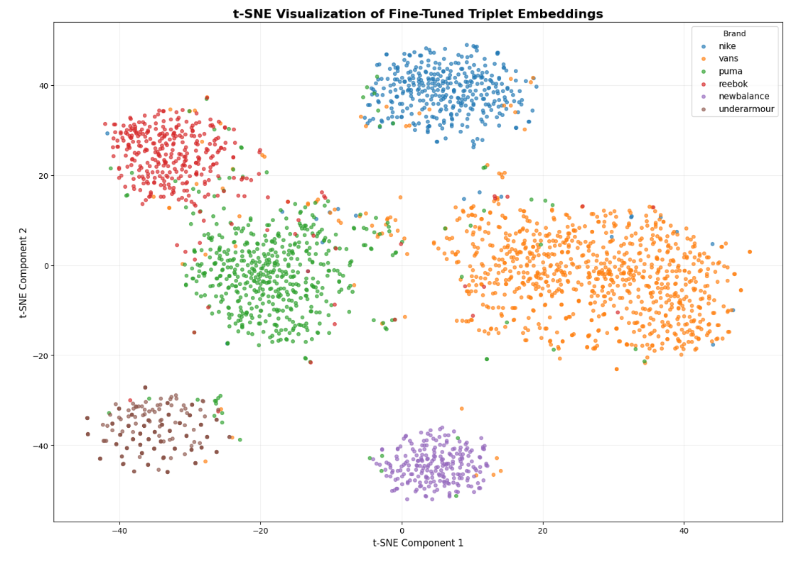

# TrustNet-AI: Multimodal Counterfeit Product and Fake Review Detection

## Overview

TrustNet-AI is a machine learning project for estimating product trust signals from reviews, product metadata, and sneaker images. The repository contains four ML components: Fake Review Detection, Metadata Counterfeit Detection, Fine-Tuned Image Retrieval, and Multimodal Trust Fusion.

The final trust pipeline combines a metadata authenticity classifier, image retrieval over fine-tuned embeddings, brand agreement, and retrieval confidence. It outputs `GENUINE`, `SUSPICIOUS`, or `LIKELY_COUNTERFEIT`.

The current implementation focuses on sneaker product listings.

### Components

- Fake Review Detection
- Metadata Counterfeit Detection
- Fine-Tuned Image Retrieval
- Multimodal Trust Fusion

Total Models: 4

## System Architecture

## Performance Summary

| Component | Metric |
|---|---:|
| Fake Review Detection Accuracy | 96.99% |
| Metadata Detection Accuracy | 99.00% |
| Trust Fusion Test 1 Accuracy | 95.24% |
| Trust Fusion Test 2 Accuracy | 76.67% |
| Trust Fusion Test 3 Accuracy | 90.00% |
| Trust Fusion Test 4 Accuracy | 93.33% |
| Fine-Tuned Retrieval Top-1 Accuracy | 92.66% |
| Fine-Tuned Retrieval Top-5 Accuracy | 96.74% |
| Fine-Tuned Retrieval Majority Vote Accuracy | 93.68% |
| Unseen FAISS Retrieval Top-1 Accuracy | 66.67% |
| Unseen FAISS Retrieval Top-5 Accuracy | 83.33% |
| Unseen FAISS Retrieval Majority Vote Accuracy | 73.33% |

## Repository Structure

| Path | Contents |
|---|---|
| `docs/architecture/` | Architecture diagrams and embedding visualization images |
| `ml/fake_review_detection/` | Review dataset, BiLSTM notebooks, tokenizer artifacts, saved review models |
| `ml/counterfeit_metadata_detection/` | Metadata datasets, metadata classifier, deprecated Siamese encoder, embeddings, tokenizers |
| `ml/counterfeit_image_detection/` | Sneaker images, triplet dataset, ResNet fine-tuning, FAISS retrieval artifacts |
| `ml/multimodal_trust_fusion/` | Trust fusion notebook and evaluation test sets |

## Datasets

### Fake Review Dataset

| Property | Value |
|---|---|
| File | `ml/fake_review_detection/datasets/shoes_reviews.csv` |
| Size | 1,821 reviews |
| Class distribution | label `0`: 968, label `1`: 853 |
| Features | `review_text`, `rating`, `label` |

### Metadata Dataset

| Property | Value |
|---|---|
| File | `ml/counterfeit_metadata_detection/datasets/metadata_classifier_dataset.csv` |
| Size | 5,284 metadata rows |
| Class distribution | label `0`: 2,642, label `1`: 2,642 |
| Features | `metadata`, `label` |

### Deprecated Siamese Dataset

| Property | Value |
|---|---:|
| File | `ml/counterfeit_metadata_detection/datasets/siamese_metadata_dataset.csv` |
| Pair count | 4,082 |
| Similar pairs | 2,041 |
| Dissimilar pairs | 2,041 |

### Sneaker Image Dataset

| Property | Value |
|---|---|
| Image directory | `ml/counterfeit_image_detection/datasets/sampled_sneakers_1024x1024/` |
| Image count | 2,642 |
| Brands | Nike: 379, Vans: 919, New Balance: 226, Puma: 547, Reebok: 341, Under Armour: 230 |
| Triplet file | `ml/counterfeit_image_detection/datasets/triplet_dataset_hard.csv` |
| Triplet count | 22,580 |

### Product Scope

The visual retrieval system is currently designed for sneaker products and was trained on six brands:

- Nike
- Vans
- Puma
- Reebok
- New Balance
- Under Armour

### Trust Fusion Test Sets

| File | Rows | Purpose |
|---|---:|---|
| `test1_genuine_metadata.csv` | 21 | Seen images with genuine metadata |
| `test2_genuine_metadata.csv` | 30 | Unseen images with genuine metadata |
| `test3_brand_mismatch.csv` | 30 | Unseen images with genuine metadata assigned to the wrong brand |
| `test4_counterfeit_metadata.csv` | 30 | Unseen images with counterfeit-style metadata |

## Fake Review Detection

### Objective

Classify shoe reviews using review text and rating metadata.

### Architecture

| Item | Value |
|---|---|
| Notebook | `ml/fake_review_detection/notebooks/FakeReviewLSTM_v2.ipynb` |
| Saved model | `ml/fake_review_detection/models/fake_review_bilstm_v2.keras` |
| Tokenizer | `ml/fake_review_detection/tokenizers/review_tokenizer_v2.pkl` |
| Model inputs | Review text sequence, numeric rating |
| Text encoder | Embedding + Bidirectional LSTM |
| Fusion layer | Text vector concatenated with rating vector |
| Parameters | 564,065 trainable |

### Results

| Metric | Score |
|---|---:|
| Accuracy | 96.99% |
| Precision | 0.97 macro avg |
| Recall | 0.97 macro avg |
| F1 | 0.97 macro avg |
| Test support | 365 |

Confusion matrix:

| True \ Predicted | 0 | 1 |
|---|---:|---:|
| 0 | 182 | 9 |
| 1 | 2 | 172 |

## Metadata Counterfeit Detection

### Objective

Classify product metadata as genuine or counterfeit-style text.

### Architecture

| Item | Value |
|---|---|
| Notebook | `ml/counterfeit_metadata_detection/notebooks/CounterfeitMetadataLSTM_v1.ipynb` |
| Saved model | `ml/counterfeit_metadata_detection/models/metadata_counterfeit_classifier_v1.keras` |
| Tokenizer | `ml/counterfeit_metadata_detection/tokenizers/metadata_classifier_tokenizer_v1.pkl` |
| Model | Embedding + Bidirectional LSTM + Dense classifier |
| Parameters | 1,559,681 trainable |

### Results

| Metric | Score |
|---|---:|
| Accuracy | 99.00% |
| Precision | 0.99 macro avg |
| Recall | 0.99 macro avg |
| F1 | 0.99 macro avg |
| Test support | 1,057 |

## Fine-Tuned Image Retrieval

### Triplet Learning Architecture

The image retrieval model learns brand-aware sneaker embeddings with triplet learning. Each training row contains an anchor image, a positive image from the same brand, and a negative image from a different brand.

| Item | Value |
|---|---|
| Notebook | `ml/counterfeit_image_detection/notebooks/ResNet_FineTuning.ipynb` |
| Triplet dataset | `ml/counterfeit_image_detection/datasets/triplet_dataset_hard.csv` |
| Triplet count | 22,580 |
| Saved encoder | `ml/counterfeit_image_detection/models/embedding_model_finetuned.keras` |

### Fine-Tuned ResNet Encoder

| Layer / Stage | Output |
|---|---|
| Image input | 224 x 224 x 3 |
| ResNet50 backbone | 7 x 7 x 2048 |
| GlobalAveragePooling2D | 2,048 |
| Dense | 512 |
| Dropout | 512 |
| Dense | 128 |
| L2 normalization | 128-dimensional embedding |

| Parameter Type | Count |
|---|---:|
| Total params | 24,702,464 |
| Trainable params | 10,046,080 |
| Non-trainable params | 14,656,384 |

### Image Retrieval Pipeline

| Artifact | Value |
|---|---|
| Embeddings | `shoe_image_embeddings_finetuned.npy` |
| Embedding shape | 2,642 x 128 |
| Filenames | `shoe_image_filenames.npy` |
| FAISS index | `shoe_faiss_index.index` |

### Embedding Space Visualization

The t-SNE plot projects the learned 128-dimensional shoe embeddings into two dimensions. Brand clusters are visible after triplet fine-tuning. This supports the metric-learning objective used for image retrieval.

### Retrieval Results

### Training Retrieval Performance

| Metric | Score |
|---------|---------:|
| Top-1 Accuracy | 92.66% |
| Top-5 Accuracy | 96.74% |
| Majority Vote Accuracy | 93.68% |

### Unseen Retrieval Performance

| Metric | Score |
|---------|---------:|
| Top-1 Brand Accuracy | 66.67% |
| Top-5 Brand Accuracy | 83.33% |
| Majority Vote Accuracy | 73.33% |

## Multimodal Trust Fusion

### Objective

Combine metadata authenticity and image retrieval signals into a single trust prediction.

### Architecture

### Inputs

| Input | Source |
|---|---|
| Metadata Authenticity Score | Metadata counterfeit classifier |
| Brand Match Ratio | Fraction of top-5 retrieved images matching query metadata brand |
| Retrieval Confidence | Mean similarity score from retrieved images |

Trust Score =

- 50% Metadata Score
- 35% Brand Match Ratio
- 15% Retrieval Confidence

### Outputs

| Output | Threshold |
|---|---|
| `GENUINE` | Trust score >= 0.75 |
| `SUSPICIOUS` | Trust score >= 0.50 and < 0.75 |
| `LIKELY_COUNTERFEIT` | Trust score < 0.50 |

## Trust Fusion Evaluation

| Test | Scenario | Accuracy |
|---|---|---:|
| Test 1 | Seen Images + Genuine Metadata | 95.24% |
| Test 2 | Unseen Images + Genuine Metadata | 76.67% |
| Test 3 | Unseen Images + Genuine Metadata with Brand Mismatch | 90.00% |
| Test 4 | Unseen Images + Counterfeit Metadata | 93.33% |

The fusion system performs strongly on brand mismatch and counterfeit metadata scenarios while maintaining reasonable generalization on unseen products.

## Deprecated Approach: Metadata Similarity Encoder

### Purpose

The metadata similarity encoder was explored for comparing pairs of product metadata strings and producing reusable metadata embeddings.

### Why It Was Explored

- It used a shared text encoder for both metadata inputs.
- It generated 128-dimensional metadata embeddings.
- It supported similarity retrieval experiments with generated metadata embeddings.

### Why It Was Replaced

- The final trust pipeline needs an authenticity score, not only metadata-to-metadata similarity.
- The metadata counterfeit classifier directly outputs a score used by the trust fusion logic.
- The final TrustNet pipeline uses the Metadata Counterfeit Classifier and not the Siamese Encoder.

### Siamese Metrics

| Metric | Value |
|---|---:|
| Pair count | 4,082 |
| Similar pairs | 2,041 |
| Dissimilar pairs | 2,041 |
| Trainable params | 328,064 |
| Final validation loss | 0.0295 |
| Final validation MAE | 0.0739 |

## Technologies

| Category | Tools |
|---|---|
| Deep Learning | TensorFlow, Keras, LSTM, BiLSTM, triplet learning |
| Computer Vision | ResNet50, image embeddings, FAISS retrieval |
| NLP | Keras tokenizers, sequence padding, text embeddings |
| Data Processing | pandas, NumPy, CSV datasets |
| Visualization | Matplotlib, t-SNE, architecture diagrams |

## Limitations

- Retrieval accuracy drops on unseen images compared with the fine-tuned image evaluation.
- Metadata classifier evaluation is based on synthetic genuine/counterfeit-style text pairs.
- Brand extraction is rule-based and limited to known sneaker brands.
- Trust fusion weights are manually assigned.

## Future Work

- Add a held-out real-world counterfeit metadata dataset.
- Store evaluation outputs as versioned CSV or JSON files.
- Replace rule-based brand extraction with a trained brand recognizer.
- Add per-brand retrieval metrics.
- Expand image retrieval evaluation beyond the current unseen test set.

## Key Learnings

- BiLSTM text models work well for structured review and metadata classification tasks in this repository.
- Triplet learning improves brand-aware image embedding retrieval.
- FAISS enables fast nearest-neighbor search over generated image embeddings.
- Metadata authenticity and retrieval agreement provide complementary trust signals.
- Unseen image retrieval remains the main source of trust fusion errors.
