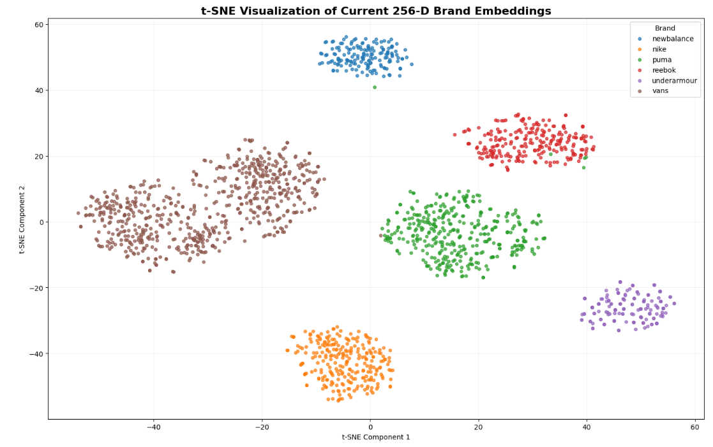

# TrustNet-AI: Multimodal Counterfeit Product and Fake Review Detection

## Overview

TrustNet-AI is a machine learning framework for evaluating e-commerce product authenticity across textual reviews, product metadata, and visual catalog imagery. The pipeline analyzes sneaker product listings through sequential natural language processing, deep visual metric retrieval, and late decision-level trust fusion.

The framework produces an interpretable composite trust score and categorical diagnostic verdicts: `GENUINE`, `SUSPICIOUS (Brand Mismatch)`, `SUSPICIOUS (Visual Anomaly)`, or `COUNTERFEIT`.

### Core ML Components

- Fake Review Classifier: Sequential BiLSTM with review text and numeric rating inputs.
- Metadata Authenticity Classifier: BiLSTM network detecting counterfeit textual patterns in listing descriptions.
- Fine-Tuned Visual Feature Retrieval: ResNet-50 penultimate feature extractor (256-D) with FAISS nearest-neighbor search.
- Multimodal Trust Fusion: Decision-level rule-governed fusion engine combining metadata authenticity, brand match ratio, and visual retrieval similarity.

## System Architecture


## Performance Summary

| Component | Evaluation Split / Scenario | Key Metric | Score |
|---|---|---|---:|
| Fake Review Detection | Held-out test set (365 reviews) | Accuracy | 96.99% |
| Fake Review Detection | Held-out test set (365 reviews) | Macro F1-Score | 0.97 |
| Metadata Counterfeit Detection | Held-out test set (1,057 listings) | Accuracy | 99.00% |
| Metadata Counterfeit Detection | Held-out test set (1,057 listings) | Macro F1-Score | 0.99 |
| Fine-Tuned Visual Retrieval (FAISS Top-1) | Unseen test set (397 images) | Top-1 Retrieval Accuracy | 90.68% |
| Fine-Tuned Visual Retrieval (FAISS Top-5) | Unseen test set (397 images) | Top-5 Retrieval Accuracy | 93.95% |
| Fine-Tuned Visual Retrieval (Majority Vote) | Unseen test set (397 images) | Majority Vote Brand Accuracy | 90.18% |
| Trust Fusion: Test 1 | Seen Images + Genuine Metadata (21 items) | Genuine Detection Rate | 95.24% |
| Trust Fusion: Test 2 | Unseen Images + Genuine Metadata (30 items) | Genuine Detection Rate | 90.00% |
| Trust Fusion: Test 3 | Unseen Images + Brand Mismatch (30 items) | Mismatch Detection Rate | 93.33% |
| Trust Fusion: Test 4 | Unseen Images + Counterfeit Metadata (30 items) | Counterfeit Detection Rate | 100.00% |

## Repository Structure

| Directory | Purpose |
|---|---|
| `docs/architecture/` | Pipeline architecture diagrams and t-SNE embedding visualizations |
| `ml/fake_review_detection/` | Review dataset, BiLSTM training notebooks, tokenizers, and saved models |
| `ml/counterfeit_metadata_detection/` | Listing metadata datasets, BiLSTM classifier, tokenizers, and deprecated Siamese assets |
| `ml/counterfeit_image_detection/` | Sneaker images, dataset splits, ResNet-50 fine-tuning, FAISS indexing, and embeddings |
| `ml/multimodal_trust_fusion/` | Late trust-fusion engine and diagnostic evaluation test sets |

## Datasets

### Fake Review Dataset

| Property | Value |
|---|---|
| File Path | `ml/fake_review_detection/datasets/shoes_reviews.csv` |
| Total Records | 1,821 reviews |
| Class Distribution | Label 0 (Genuine): 968, Label 1 (Fake): 853 |
| Input Features | `review_text`, `rating`, `label` |

### Metadata Classifier Dataset

| Property | Value |
|---|---|
| File Path | `ml/counterfeit_metadata_detection/datasets/metadata_classifier_dataset.csv` |
| Total Records | 5,284 listings |
| Class Distribution | Label 0 (Counterfeit-Style): 2,642, Label 1 (Authentic): 2,642 |
| Input Features | `metadata`, `label` |

### Sneaker Image Dataset

| Property | Value |
|---|---|
| Image Directory | `ml/counterfeit_image_detection/datasets/sampled_sneakers_1024x1024/` |
| Image Count | 2,642 catalog photographs |
| Image Resolution | 1024 x 1024 RGB (preprocessed to 224 x 224) |
| Brand Coverage | Vans: 919, Puma: 547, Nike: 379, Reebok: 341, Under Armour: 230, New Balance: 226 |
| Dataset Splits | Train: 1,848 (70%), Validation: 397 (15%), Test: 397 (15%) |

### Diagnostic Trust Fusion Test Sets

| File Path | Sample Count | Evaluation Target |
|---|---:|---|
| `ml/multimodal_trust_fusion/testing/test1_genuine_metadata.csv` | 21 | In-catalog (seen) images paired with genuine metadata |
| `ml/multimodal_trust_fusion/testing/test2_genuine_metadata.csv` | 30 | Out-of-catalog (unseen) images paired with genuine metadata |
| `ml/multimodal_trust_fusion/testing/test3_brand_mismatch.csv` | 30 | Unseen images paired with valid metadata from an opposing brand |
| `ml/multimodal_trust_fusion/testing/test4_counterfeit_metadata.csv` | 30 | Unseen images paired with synthetic counterfeit-style metadata |

## Fake Review Detection

### Objective

Identify deceptive consumer reviews by jointly processing review text semantics and numerical rating metadata.

### Architecture


The text branch projects tokens through a 64-dimensional embedding layer into a 64-unit Bidirectional LSTM. The scalar rating is processed through a dense projection layer. The text and rating representations are concatenated and passed through dense classification layers with dropout regularization.

| Specification | Value |
|---|---|
| Notebook | `ml/fake_review_detection/notebooks/FakeReviewLSTM_v2.ipynb` |
| Model Artifact | `ml/fake_review_detection/models/fake_review_bilstm_v2.keras` |
| Tokenizer Artifact | `ml/fake_review_detection/tokenizers/review_tokenizer_v2.pkl` |
| Vocabulary Size | 5,000 tokens (sequence length: 200) |
| Total Parameters | 564,065 trainable |

### Results

Evaluated on 365 held-out test reviews:

| Metric | Score |
|---|---:|
| Accuracy | 96.99% |
| Macro Precision | 0.97 |
| Macro Recall | 0.97 |
| Macro F1-Score | 0.97 |

Confusion Matrix:
- True Negative (Genuine): 182
- False Positive: 9
- False Negative: 2
- True Positive (Fake): 172

## Metadata Counterfeit Detection

### Objective

Detect unauthorized, fraudulent, or counterfeit product descriptions by learning lexical and stylistic anomalies in listing metadata.

### Architecture


Listing metadata is tokenized and mapped via a 128-dimensional embedding layer into a 64-unit Bidirectional LSTM. Sequence representations are processed by dense layers with dropout and a sigmoid output node for authenticity probability estimation.

| Specification | Value |
|---|---|
| Notebook | `ml/counterfeit_metadata_detection/notebooks/CounterfeitMetadataLSTM_v1.ipynb` |
| Model Artifact | `ml/counterfeit_metadata_detection/models/metadata_counterfeit_classifier_v1.keras` |
| Tokenizer Artifact | `ml/counterfeit_metadata_detection/tokenizers/metadata_classifier_tokenizer_v1.pkl` |
| Vocabulary Size | 10,000 tokens (sequence length: 150) |
| Total Parameters | 1,559,681 trainable |

### Results

Evaluated on 1,057 held-out metadata listings:

| Metric | Score |
|---|---:|
| Accuracy | 99.00% |
| Macro Precision | 0.99 |
| Macro Recall | 0.99 |
| Macro F1-Score | 0.99 |

## Visual Representation Learning and Image Retrieval

### Objective

Map product photographs into a metric embedding space to retrieve reference catalog items, verify brand consistency, and detect visual counterfeit anomalies without relying on closed-set classification.

### Architecture and Retrieval Pipeline


A ResNet-50 backbone pre-trained on ImageNet is fine-tuned with its final 30 layers unfrozen. Rather than using the final 6-class softmax output for classification, the 256-dimensional penultimate dense layer representation is extracted and L2 normalized. 

Embeddings from 1,848 authentic training images are indexed using FAISS `IndexFlatIP`. At inference, query images are projected into the 256-D metric space and compared via inner product (cosine similarity) to retrieve top-5 nearest catalog neighbors.

| Specification | Value |
|---|---|
| Fine-Tuning Notebook | `ml/counterfeit_image_detection/notebooks/003_ResNet_FineTuning.ipynb` |
| Retrieval Notebook | `ml/counterfeit_image_detection/notebooks/004_FaissImageRetrieval.ipynb` |
| Base Backbone | ResNet-50 (ImageNet weights, last 30 layers trainable) |
| Classifier Model | `ml/counterfeit_image_detection/models/brand_classifier_resnet50.keras` |
| Embedding Model | `ml/counterfeit_image_detection/models/embedding_model_finetuned.keras` |
| Total Parameters | 24,113,798 (14,976,262 trainable) |
| Metric Index | FAISS `IndexFlatIP` (`shoe_faiss_index_v1.index`) |
| Embeddings Artifact | `shoe_image_embeddings_finetuned_v1.npy` (1,848 x 256) |

### Embedding Space Visualization



t-SNE visualization of the 256-dimensional penultimate embeddings reveals distinct brand clustering across all six target footwear categories.

### Retrieval Performance

Evaluated across top-5 nearest neighbors on 397 unseen test images:

| Metric | Validation Set (397 items) | Test Set (397 items) |
|---|---:|---:|
| Top-1 Retrieval Accuracy | 90.18% | 90.68% |
| Top-5 Retrieval Accuracy | 93.95% | 93.95% |
| Majority Vote Brand Accuracy | 89.67% | 90.18% |

## Multimodal Trust Fusion

### Objective

Integrate textual metadata authenticity, brand retrieval alignment, and visual cosine similarity into a unified diagnostic trust score.

### Decision Pipeline

The late fusion framework computes a composite Trust Score from exactly three normalized signals:

- Metadata Authenticity Score (S_meta): Probability output from the BiLSTM metadata classifier in [0, 1].
- Brand Match Ratio (R_brand): Fraction of the top-5 retrieved catalog images whose indexed brand matches the claimed brand in [0, 1].
- Mean Top-K Retrieval Similarity (C_ret): Mean cosine similarity across the top-5 retrieved neighbors in [-1, 1].

Composite formulation:
```text
Trust Score = 0.50 * S_meta + 0.35 * R_brand + 0.15 * max(0, C_ret)
```

Decision thresholds and diagnostic logic:
- `GENUINE`: Trust Score >= 0.75, R_brand >= 0.60, S_meta >= 0.70.
- `SUSPICIOUS (Brand Mismatch)`: R_brand < 0.40.
- `SUSPICIOUS (Visual Anomaly)`: C_ret < 0.50.
- `COUNTERFEIT`: Trust Score < 0.50 or S_meta < 0.40.

### Diagnostic Evaluation Results

Evaluated across four controlled marketplace scenarios:

| Test Set | Scenario Description | Sample Size | Primary Evaluation Metric | Result |
|---|---|---:|---|---:|
| Test 1 | In-catalog images with genuine metadata | 21 | Genuine classification rate | 95.24% |
| Test 2 | Unseen images with genuine metadata | 30 | Genuine classification rate | 90.00% |
| Test 3 | Unseen images with brand mismatch metadata | 30 | Brand mismatch detection rate | 93.33% |
| Test 4 | Unseen images with counterfeit metadata | 30 | Counterfeit detection rate | 100.00% |

## Deprecated Approaches

During architecture development, alternative similarity and metric learning formulations were implemented and evaluated before adopting the final production pipeline.

### Deprecated Approach 1: Triplet Loss ResNet Fine-Tuning


#### Description
- Architecture: Triplet network trained with semi-hard and hard triplet mining (anchor, positive, negative image pairs).
- Notebook: `ml/counterfeit_image_detection/notebooks/002_GenerateTriplets - (Deprecated).ipynb`.
- Objective: Minimize distance between intra-brand pairs while enforcing a margin separation against inter-brand negatives.

#### Why It Was Deprecated
- High sample variance in triplet mining resulted in unstable optimization dynamics.
- Intra-brand diversity (e.g., lifestyle sneakers vs. performance running shoes within Nike) caused cluster degradation.
- Direct fine-tuning of the ResNet-50 backbone with categorical cross-entropy followed by 256-D penultimate feature extraction yielded superior visual separation (93.95% Top-5 retrieval) with significantly faster convergence.

---

### Deprecated Approach 2: Metadata Siamese Similarity Encoder


#### Description
- Architecture: Twin BiLSTM encoders sharing weights across paired metadata inputs to compute 128-dimensional sentence vectors.
- Notebooks: `ml/counterfeit_metadata_detection/notebooks/SiameseMetadataEncoder_v1.ipynb`, `MetadataSimilarityRetrieval.ipynb`.
- Dataset: `ml/counterfeit_metadata_detection/datasets/siamese_metadata_dataset.csv` (4,082 text pairs).
- Validation Loss: 0.0295 MSE; Validation MAE: 0.0739.

#### Why It Was Deprecated
- Pairwise textual similarity measures lexical and stylistic proximity between two descriptions rather than whether a single listing is inherently deceptive.
- The downstream trust fusion pipeline requires a calibrated authenticity score (S_meta), which cannot be directly obtained from relative vector distance without an authentic anchor database.
- Replacing the Siamese encoder with the supervised BiLSTM Metadata Classifier directly yielded a calibrated authenticity score with 99.00% accuracy.

## Technology Stack

| Category | Libraries and Tools |
|---|---|
| Deep Learning | TensorFlow 2.x, Keras, BiLSTM, ResNet-50 |
| Vector Retrieval | FAISS (Facebook AI Similarity Search) |
| NLP & Tokenization | Keras Preprocessing, Tokenizer, Sequence Padding |
| Numerical & Data Processing | NumPy, Pandas, Scikit-Learn |
| Dimensionality Reduction | Scikit-Learn t-SNE |
| Visualization | Matplotlib |
